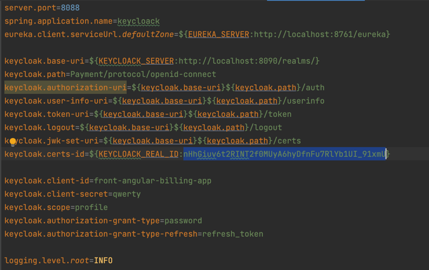

# Microservices with spring boot and spring cloud.

## Stack :
>- Spring Boot 2.7.5
>- Spring cloud 2021.0.5
>- Keycloack server
>- Java 11
>- Postgresql
>- Docker
>- Docker compose

## Solution diagram


## Getting Started

First, run the commands:

```
./gradlew initBuildJars --parallel
```

```
./gradlew buildImageDocker --parallel
```

```
docker-compose -f docker-compose-init.yml up
```

Open [http://localhost:8090/admin](http://localhost:8090/admin) with your browser to configure keycloack.

Login with the credentials defined in the .env file
```
KEYCLOAK_ADMIN=admin
KEYCLOAK_ADMIN_PASSWORD=admin123
```
Create realm (Payment).


Go to Keys in the realm and copy the key of the provider
rsa-generated.


Create the client.


Put the client Id in .env file.

```
KEYCLOACK_CLIENT_ID
```

Create user and set password.


Copy the key of provider and put in .env file and the bootstrap file of the 
keycloack project.

```
KEYCLOACK_REAL_ID
```



```
docker-compose -f docker-compose.yml up
```

Stop the containers.

# Run

```
docker-composes up
```

Use the postman collection with endpoints.